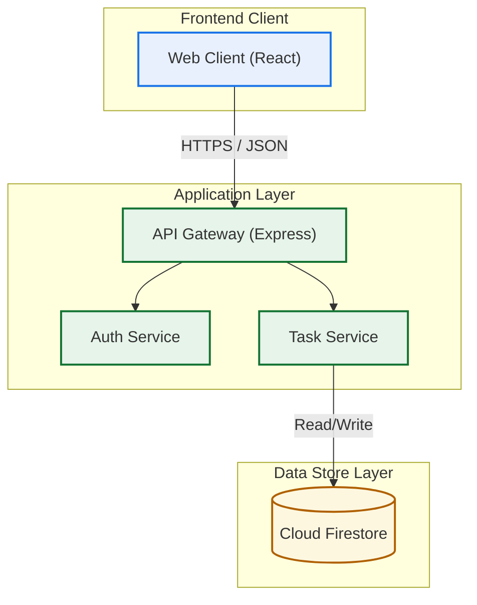
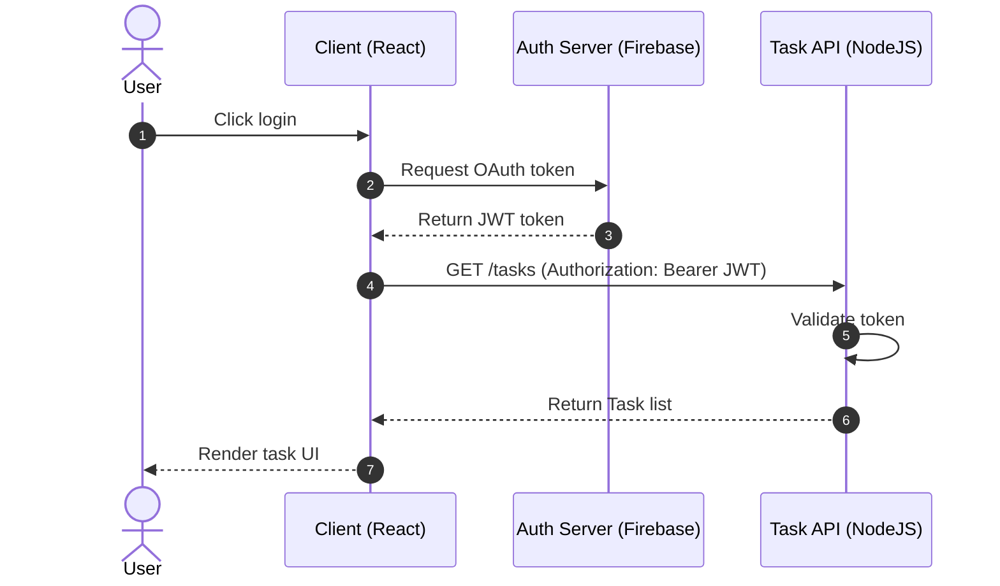

# Creating Mermaid Diagrams Skill

Use this skill to design, structure, and render Mermaid diagrams correctly. Mermaid is highly sensitive to syntax errors. A single syntax error will prevent the entire diagram from rendering.

## Key Mermaid Syntax Guidelines & Gotchas

### 1. Quote Labels with Special Characters
- **Gotcha**: Unquoted parentheses `()`, brackets `[]`, braces `{}`, quotes `"`, or other special characters inside node labels will crash the Mermaid parser.
- **Do this**: Always wrap node text containing special characters in double quotes.
- **Examples**:
  - ❌ `client[Browser (React)]`
  - ✅ `client["Browser (React)"]`
  - ❌ `db[(PostgreSQL DB)]`
  - ✅ `db[("(PostgreSQL DB)"]`

### 2. Avoid HTML Tags in Labels
- **Gotcha**: Using raw HTML like `<br>`, `<b>`, or `<i>` in Mermaid labels can break rendering depending on the environment configuration.
- **Do this**: Use standard quotes for multiline text or use standard Mermaid node styling. For line breaks in quotes, use `\n` inside the string.
- **Example**:
  - ❌ `node[Line 1<br>Line 2]`
  - ✅ `node["Line 1\nLine 2"]`

### 3. Subgraphs and Layout Directions
- Keep subgraphs organized to represent logical layers (e.g., Client, API Gateway, Services, Database).
- Use `direction` inside subgraphs to align them properly (e.g., `direction LR` or `direction TB`).
- **Example**:
  ```mermaid
  flowchart TB
      subgraph ClientLayer["Client Layer"]
          direction LR
          web["Web App (React)"]
          mobile["Mobile App (iOS/Android)"]
      end
  ```

### 4. Connection Styling and Arrowheads
- Use descriptive arrow types: `-->` for standard link, `-.->` for dependency/async link, `==>` for high-throughput or database writes.
- Add text to connections using the `A -->|label| B` or `A -- label --> B` syntax. Ensure the label text is clean and doesn't contain unquoted special characters.

### 5. Styling and Classes
- Define classes to color-code components for better visual hierarchy (e.g., frontend vs. backend vs. database).
- Example class definitions:
  ```mermaid
  classDef frontend fill:#e8f0fe,stroke:#1a73e8,stroke-width:2px;
  classDef backend fill:#e6f4ea,stroke:#137333,stroke-width:2px;
  classDef database fill:#fef7e0,stroke:#b06000,stroke-width:2px;
  class db database;
  class web frontend;
  ```

## Reference Templates

### 1. 3-Tier Architecture Diagram Template


### 2. Sequence Diagram Template


## Verification Checklist
Before rendering any Mermaid block:
- [ ] Are all parentheses, brackets, braces, and special characters inside node labels wrapped in double quotes?
- [ ] Are there any unquoted HTML tags in node labels?
- [ ] Does every subgraph have a unique ID and a readable, quoted title?
- [ ] Are all classes defined correctly and applied to valid node IDs?
- [ ] Does it render correctly in standard markdown viewers?
